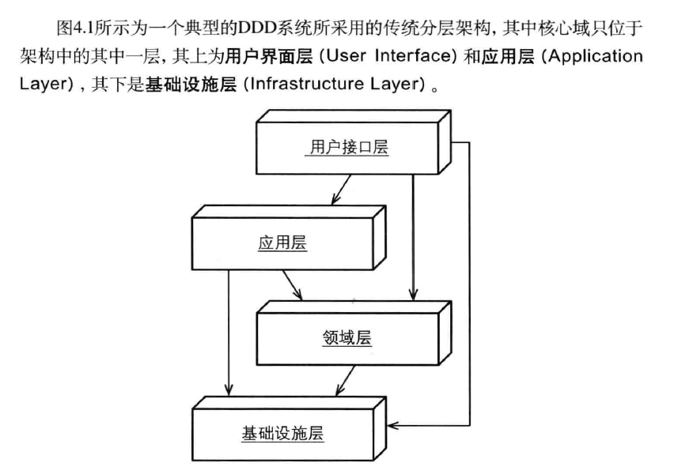
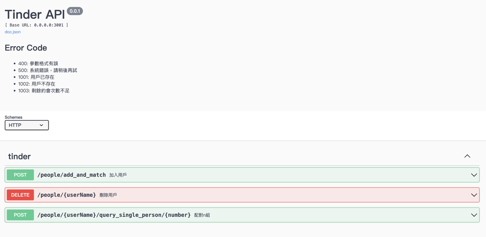

# 為 Tinder 匹配系統設計一個 HTTP 伺服器

## 題目需求說明
Please follow the following requirements to implement an HTTP server and post your GitHub repo link. 
Design an HTTP server for the Tinder matching system. The HTTP server must support the following three APIs: 
1. AddSinglePersonAndMatch : Add a new user to the matching system and find any possible matches for the new user. 
2. RemoveSinglePerson : Remove a user from the matching system so that the user cannot be matched anymore. 
3. QuerySinglePeople : Find the most N possible matched single people, where N is a request parameter. 
Here is the matching rule: 
- A single person has four input parameters: name, height, gender, and number of wanted dates. 
- Boys can only match girls who have lower height. Conversely, girls match boys who are taller. 
- Once the girl and boy match, they both use up one date. When their number of dates becomes zero, they should be removed from the matching system. 
Note : Please do not use other databases such as MySQL or Redis, just use in-memory data structure which in application to store your data. 
Other requirements : 
- Unit test
- Docker image 
- Structured project layout 
- API documentation 
- System design documentation that also explains the time complexity of your API - You can list TBD tasks.


## 系統設計文件
### 數據儲存思路
> 備註：題目配對規則沒提到需要隨機，故先以效能為優先考量。

最直觀的資料儲存方式，就是使用一個 map 來儲存所有User資料，key 為 user 的 name (當成用戶帳號)，value 為 user 的資料。
但這樣每次進行配對或查詢n個配對結果，最差情況會遍歷整個 map，時間複雜度為 O(n)。


為了最佳化時間複雜度，我會從兩個面向去優化：
1. 將男女User資料分開儲存，這樣可以減少配對查詢時，需要遍歷的資料量(時間複雜度的n從user數變成性別資料集數)。
2. 使用AVL樹去優化查詢時間，利用平衡的特性(新增/刪除/查詢時間複雜度為 O(log(n)))。

**AVL樹直接使用pkg[emirpasic/gods/tree](https://github.com/emirpasic/gods/tree/v1.18.1)**
其中AVL樹的key設置身高，value為相同身高的user指針清單（slice）。這樣也可以壓縮樹的高度，使時間複雜度更佳。


## Structured project layout 
我習慣使用類DDD的設計，能有效地把一個大系統，設計得更易於微服務拆分。
依業務邏輯明確定義了領域各領域職責，實現高內聚
加上盡量鬆散的架構分層，能降低各層級間的耦合，更易於單元測試

[圖片來源](https://github.com/KendoCross/kendoDDD)
* 用戶接口層(handler)：將最上層抽象，可方便替換成gin/grpc/http實作，檢查接收資料正確性
* 領域層(domain)：定義各領域核心業務的對象，但我將業務邏輯改到service層
* 邏輯層(service)：上圖的應用層我改業務邏輯實作在這。
* 資料層(repository)：該層用於數據持久化操作，方便替換用不同數據庫來實作。

### 其他目錄結構
* `cmd`：主程式進入點。
* `config`：配置文件採用yaml格式，方便分類。
* `internal`：內部包，包含各層級實現。


## 時間複雜度
> 假設n是男性或女性的用戶數
1. **加入用戶並配對**
   - 時間複雜度：O(log n)

2. **移除用戶**
   - 時間複雜度：O(log n)

3. **查詢配對**
   - 時間複雜度：O(log n)

## Swagger API文件
```
go run cmd/swagger/main.go
open http://127.0.0.1:3002/swagger/index.html#/
```


## 運行測試
運行測試
`go test ./internal/user/service  -coverpkg=./internal/user/service -coverprofile ./coverage.out`
檢查涵蓋率
`go tool cover -func ./coverage.out`

## Build docker image
`docker build ./Dockerfile`

## 運行docker image
`docker run -d <imageID> -p 3001:3001`運行 api 鏡像。